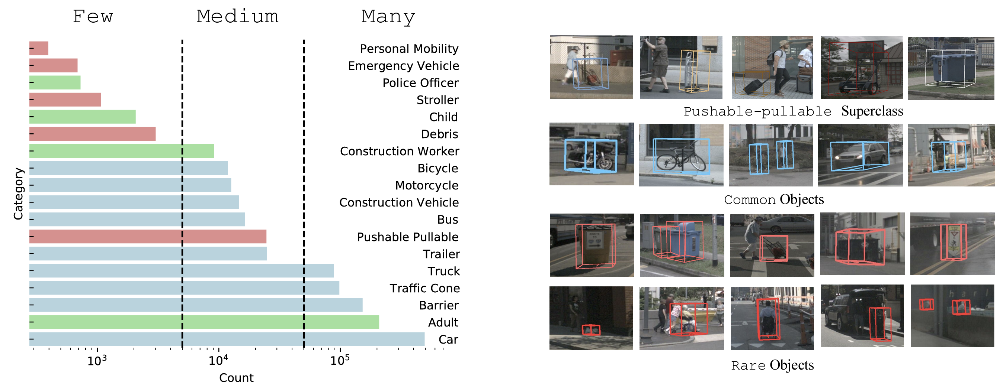

# Towards Long Tailed 3D Detection

Neehar Peri, Achal Dave, Deva Ramanan, Shu Kong

<p align="center">  </p>

## Abstract [[PDF](https://arxiv.org/pdf/2211.08691.pdf)]
Contemporary autonomous vehicle (AV) benchmarks have advanced techniques for training 3D detectors, particularly on large-scale LiDAR data. Surprisingly, although semantic class labels naturally follow a long-tailed distribution, these benchmarks focus on only a few common classes (e.g., pedestrian and car) and neglect many rare classes in-the-tail (e.g., debris and stroller). However, in the real open world, AVs must still detect rare classes to ensure safe operation. Moreover, semantic classes are often organized within a hierarchy, e.g., tail classes such as child and construction-worker are arguably subclasses of pedestrian. However, such hierarchical relationships are often ignored, which may yield misleading estimates of performance and missed opportunities for algorithmic innovation. We address these challenges by formally studying the problem of Long-Tailed 3D Detection (LT3D), which evaluates on all classes, including those in-the-tail. We evaluate and innovate upon popular 3D detectors, such as CenterPoint and PointPillars, adapting them for LT3D. We develop hierarchical losses that promote feature sharing across common-vs-rare classes, as well as improved detection metrics that award partial credit to “reasonable” mistakes respecting the hierarchy (e.g., mistaking a child for an adult). Finally, we point out that fine-grained tail class accuracy is particularly improved via multimodal fusion of RGB images with LiDAR; simply put, fine-grained classes are challenging to identify from sparse (LiDAR) geometry alone, suggesting that multimodal cues are crucial to long-tailed 3D detection. Our modifications improve accuracy by 5% AP on average for all classes, and dramatically improve AP for rare classes (e.g., stroller AP improves from 0.1 to 31.6)!

## Contact
Any questions or discussion are welcome! Please raise an issue (preferred), or send me an email.

Neehar Peri [[nperi@cs.cmu.edu](mailto:nperi@cs.cmu.edu)]

## Installation 

Modified from [det3d](https://github.com/poodarchu/Det3D/tree/56402d4761a5b73acd23080f537599b0888cce07)'s original document.

### Requirements

- OS: Ubuntu 18.04
- Python: 3.8
- PyTorch: 1.10.1
- spconv: 2.0
- CUDA: 11.1
- CUDNN: 8.0.4.30
- CMake 3.13.2 or higher

#### Notes
- As part of this code release we have installed this software and run the training and evaluation scripts in a new conda environment to verify the installation process described below. 

### Basic Installation 

```bash
# Basic python libraries
conda create --name lt3d python=3.8
conda activate lt3d
git clone git@github.com:neeharperi/LT3D.git
```

#### CUDA Extensions

```bash
# Set the CUDA/CuDNN path (change the path to your own CUDA location) 
export PATH=/opt/cuda/11.1.1/bin:$PATH
export CUDA_ROOT=/opt/cuda/11.1.1
export CUDA_HOME=/opt/cuda/11.1.1
export LD_LIBRARY_PATH=/opt/cuda/11.1.1/lib64:$LD_LIBRARY_PATH
export LD_LIBRARY_PATH=/opt/cuda/11.1.1/lib:$LD_LIBRARY_PATH

export CUDNN_ROOT=/opt/cudnn/cuda-11.1/8.0.4.30/cuda
export CUDNN_HOME=/opt/cudnn/cuda-11.1/8.0.4.30/cuda
export CUDNN_LIBRARY=/opt/cudnn/cuda-11.1/8.0.4.30/cuda/lib64
export CUDNN_INCLUDE_DIR=/opt/cudnn/cuda-11.1/8.0.4.30/cuda/include
```

#### nuScenes LT3D dev-kit

```bash
git clone git@github.com:neeharperi/nuscenes-lt3d.git
```

#### Argoverse 2.0 LT3D dev-kit

```bash
git clone git@github.com:neeharperi/av2-lt3d.git
```


#### Compiling mmdetection3d

```bash
bash setup.sh
```

We also provide additional setup instructions for using AWS or Lambda Cloud under setup.

### Benchmark Evaluation and Training

#### Prepare Data for Training and Evaluation 

```
# For nuScenes Dataset         
└── NUSCENES_DATASET_ROOT
       ├── samples       <-- key frames
       ├── sweeps        <-- frames without annotation
       ├── maps          <-- unused
       ├── v1.0-trainval <-- metadata
```

Data creation should be under the GPU environment.

```
# nuScenes 
#python tools/create_data.py nuscenes_data_prep --root_path NUSCENES_DATASET_ROOT --version v1.0-trainval

```

In the end, the data and info files should be organized as follows

```
# For nuScenes Dataset 
└── NUSCENES_DATASET_ROOT
      ├── samples       <-- key frames
      ├── sweeps        <-- frames without annotation
      ├── maps          <-- unused
      |── v1.0-trainval <-- metadata and annotations
      |__ trainval_forecast
          |── infos_train_10sweeps_withvelo_filter_True.pkl <-- train annotations
          |── infos_val_10sweeps_withvelo_filter_True.pkl <-- val annotations
          |── dbinfos_train_10sweeps_withvelo.pkl <-- GT database info files
          |── gt_database_10sweeps_withvelo <-- GT database 
```


Use the following command to start a distributed training and evaluation. The models, logs, and evaluation results will be saved to ```work_dirs/CONFIG_NAME```.

#### LiDAR-Only Models
```bash

```

#### Monocular RGB Models
```bash

```

#### FutureDet
```bash


```
#### Evaluation Parameters
```bash

```

### [Pre-trained Models](http://www.neeharperi.com/TODO)

### TransFusion: https://github.com/neeharperi/TransFusion-LT3D
### MMDetection3D Documentation: https://mmdetection3d.readthedocs.io/en/latest/

## Acknowlegement
This project is not possible without multiple great opensourced codebases. We list some notable examples below. 

* [det3d](https://github.com/poodarchu/det3d)
* [mmcv](https://github.com/open-mmlab/mmcv)
* [mmdetection](https://github.com/open-mmlab/mmdetection)
* [mmdetection3d](https://github.com/open-mmlab/mmdetection3d)

Thanks Andrew Shen (@Redrew) for helping with the tracking and forecasting baselines and evaluation and Yechi Ma (@mayechi) for helping test this codebase. 

If you find this codebase useful, please consider citing:

    @article{peri2022towards,
      title={Towards Long Tailed 3D Detection},
      author={Peri, Neehar and Ramanan, Deva, and Kong, Shu},
      journal={CoRL},
      year={2022},
    }
